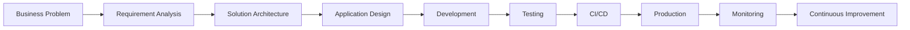

<div align="center">

# 👋 Hi, I'm Deepu Mohan

### Technical Lead • Software Architect • Full-Stack Engineer


<br/><br/>


<br/>

🇮🇳 **From India** &nbsp; • &nbsp; 🇸🇦 **Currently working in Saudi Arabia**

<br/><br/>

<a href="mailto:deepumohan.work@gmail.com">

</a>

<a href="https://github.com/Deepu-mohan">

</a>

</div>

---

## 🚀 About Me

I'm a **Technical Lead & Software Architect** with **12+ years of experience** designing, developing, and delivering enterprise software solutions.

My experience spans multiple domains:

- 🏭 Manufacturing & Industrial Software
- 🏢 Enterprise & ERP Systems
- 🏠 Real Estate
- 🛒 E-Commerce
- 📱 Mobile Applications
- ☁️ Cloud Applications
- 🔗 Enterprise System Integration

My current focus is on **enterprise application architecture, manufacturing digitalization, production traceability, mobile applications, ERP integrations, cloud platforms, DevOps, automation, and AI-enabled enterprise solutions**.

I work closely with **end users, business teams, management, vendors, infrastructure teams, and developers** to transform operational challenges into scalable software solutions.

> 💡 **Keep the architecture clean. Keep the solution simple. Solve the actual business problem.**

---

## 💼 What I Do

```text
🏗️  Solution & Software Architecture
💻  Enterprise Application Development
👥  Technical Leadership & Team Mentoring
🔌  REST API & System Integration
🏭  Manufacturing Digitalization
📱  Web & Mobile Application Development
☁️  Cloud Architecture & Azure
🗄️  Database Architecture & Optimization
⚙️  CI/CD & DevOps
🔐  Application Security
📊  Reporting & Business Intelligence
🤖  AI / LLM / Agentic AI
```

---

# 🏭 Current Projects & Focus

## 🔋 Manufacturing Traceability Platform

Designing and developing an **end-to-end battery traceability ecosystem** covering the complete product lifecycle.

```text
Production
    ↓
Serial Number / 2D Code
    ↓
Production Line
    ↓
Palletization
    ↓
Warehouse
    ↓
Shipping
    ↓
Consumer Registration
    ↓
Warranty
```

### Key Areas

- ⚙️ Production-line integration
- 🔢 Serial-number tracking
- 🏷️ 2D code generation & tracking
- 🔦 Laser marking integration
- 🔌 PLC communication
- 🔗 QAD ERP integration
- 📦 Pallet tracking
- 🏭 Warehouse integration
- ☁️ Cloud synchronization
- 📱 Consumer registration
- 🚚 Supply-chain applications
- 🛡️ Warranty processing
- 📊 Reporting & analytics

---

## 📦 Physical / Cycle Count Digitization

Developing an enterprise inventory-counting platform for manufacturing and warehouse operations.

### Features

- 📱 Mobile & PDA scanning
- 🔢 Serial inventory counting
- 📦 Loose inventory counting
- 🧩 Mixed pallet counting
- 📅 Monthly sessions
- ⚡ Ad-hoc sessions
- 🔗 QAD inventory validation
- 👥 Multi-user counting
- 💰 Finance verification
- 🔍 Auditor review
- 📊 Variance reporting
- 📥 Excel exports
- 🖥️ Web administration portal

---

## 🧾 E-Invoicing & ZATCA Integration

Architecting an enterprise **B2B/B2C e-invoicing platform** for Saudi Arabia.

```text
QAD ERP
   ↓
Invoice Retrieval
   ↓
Invoice Validation
   ↓
B2B / B2C Processing
   ↓
ZATCA Compliance
   ↓
ZATCA Integration
   ↓
Invoice Status & Audit
```

### Architecture & Technologies

- ASP.NET Core
- N-Tier / Clean Architecture
- REST APIs
- Microsoft SQL Server
- JWT Authentication
- Role & Permission Management
- Audit Logging
- B2B Invoice Processing
- B2C Invoice Processing
- ZATCA Integration
- API Request / Response Logging
- CI/CD Deployment

---

# 🤖 AI & Agentic Systems

I'm currently exploring how **Artificial Intelligence and Agentic AI** can enhance enterprise and manufacturing applications.

My areas of interest include:

```text
🤖 Agentic AI
🧠 Large Language Models
📚 RAG — Retrieval-Augmented Generation
🦙 Local LLMs / Ollama
🔎 Enterprise Knowledge Search
📄 Intelligent Document Processing
🧾 AI-assisted Invoice Validation
🏭 Manufacturing AI Assistants
📊 AI-powered Reporting
⚙️ Intelligent Workflow Automation
```

My goal is to combine:

### 🏗️ Enterprise Architecture + 🏭 Manufacturing + ☁️ Cloud + 🤖 AI

to build smarter, scalable business systems.

---

# 🧰 Technology Stack

## 💻 Programming Languages

<p align="left">


</p>

---

## ⚙️ Backend Development

<p align="left">


</p>

`ASP.NET Core` • `MVC` • `Web API` • `ADO.NET` • `REST API` • `JWT` • `Swagger`

---

## 🎨 Frontend Development

<p align="left">


</p>

`React` • `Angular` • `JavaScript` • `TypeScript` • `HTML5` • `CSS3` • `Bootstrap`

---

## 📱 Mobile Development

<p align="left">


</p>

`Flutter` • `Dart` • `Firebase` • `Android` • `iOS` • `PDA / Barcode Scanner Integration`

---

## 🗄️ Databases

<p align="left">


</p>

`Microsoft SQL Server` • `MySQL` • `PostgreSQL` • `Stored Procedures` • `Database Design` • `Query Optimization`

---

## ☁️ Cloud & DevOps

<p align="left">


</p>

`Microsoft Azure` • `Azure Functions` • `IIS` • `Docker` • `GitHub Actions` • `CI/CD` • `Windows Server`

---

## 🛠️ Development Tools

<p align="left">


</p>

`Visual Studio` • `VS Code` • `Postman` • `Swagger` • `Git` • `Power BI`

---

# 🧠 Software Architecture

My typical engineering approach:



I focus on building systems that are:

<div align="center">

### ⚡ Scalable • 🧩 Maintainable • 🔐 Secure
### 📊 Observable • 🧪 Testable • 💼 Business-Oriented

</div>

---

# 👨‍💼 Technical Leadership

My responsibilities extend well beyond software development.

I work across:

- 🏗️ Architecture & technology decisions
- 📋 Requirement analysis
- 🗺️ Technical project planning
- 👨‍💻 Code reviews
- 🧠 Architecture reviews
- 👥 Developer mentoring
- 🤝 Vendor coordination
- 🗣️ Stakeholder & management communication
- 🚀 Production deployment
- 🔐 Security reviews
- 🔧 Production troubleshooting
- 🖥️ Infrastructure coordination
- 🔄 Agile delivery
- 📚 Technical documentation
- 📐 Engineering standards

I regularly work with both **technical and non-technical stakeholders**, translating business requirements into practical engineering solutions.

---

# 🏆 Professional Experience

<div align="center">

### 12+ Years of Software Engineering Experience

</div>

```text
                    12+ Years
                        │
               Software Engineering
                        │
          ┌─────────────┴─────────────┐
          │                           │
 Technical Leadership          Software Architecture
          │                           │
    ┌─────┴─────┐               ┌─────┴─────┐
    │           │               │           │
Manufacturing  ERP          Enterprise     Cloud
E-Commerce     Mobile       APIs           AI
Real Estate    DevOps       Integration    Automation
```

---

# 🎓 Certification

🏅 **Microsoft Certified Technology Specialist (MCTS)**

---

# 📚 Currently Learning

<div align="center">


</div>

<br/>

My long-term growth direction:

<div align="center">

### Software Architecture → Engineering Leadership → AI Architecture → CTO

</div>

---

# 🎯 Engineering Philosophy

```csharp
public class EngineeringPhilosophy
{
    public string Mission =>
        "Build software that solves real business problems.";

    public string Architecture =>
        "Keep systems simple, scalable and maintainable.";

    public string Leadership =>
        "Enable the team instead of becoming the bottleneck.";

    public string Quality =>
        "Design for reliability, security and observability.";

    public string Learning =>
        "Never stop learning.";

    public string Goal =>
        "Build technology that creates measurable business value.";
}
```

---

# 📊 GitHub Analytics

<div align="center">


</div>

<br/>

<div align="center">


</div>

---

# 📈 Contribution Activity

<div align="center">


</div>

---

# 🐍 Contribution Snake

<div align="center">

<picture>
  <source
    media="(prefers-color-scheme: dark)"
    srcset="https://raw.githubusercontent.com/Deepu-mohan/Deepu-mohan/output/github-contribution-grid-snake-dark.svg"
  />

  <source
    media="(prefers-color-scheme: light)"
    srcset="https://raw.githubusercontent.com/Deepu-mohan/Deepu-mohan/output/github-contribution-grid-snake.svg"
  />

  
</picture>

</div>

---

# 💬 Ask Me About

<div align="center">


</div>

<br/>

```text
🏗️ Software Architecture
💻 .NET / ASP.NET Core
🔌 REST API Design
📱 Web & Mobile Applications
🏭 Manufacturing Software
🔋 Production Traceability
🔗 ERP / QAD Integration
☁️ Azure & Cloud Architecture
⚙️ CI/CD & DevOps
👥 Technical Leadership
📋 Project Management
🤖 AI /
